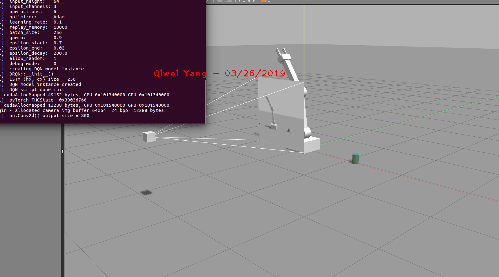
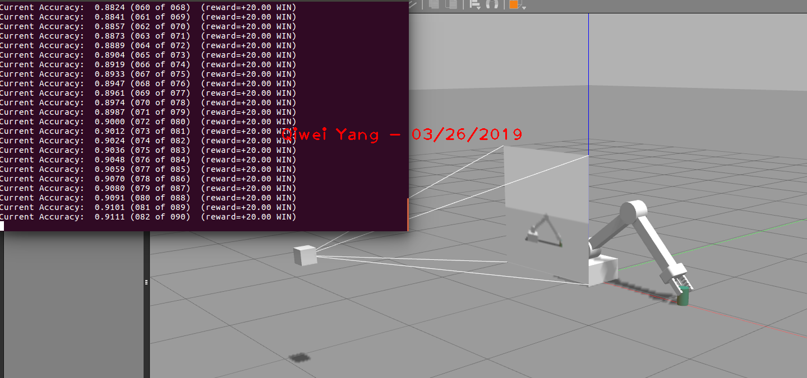

# Reinforcement-learning-Arm-Manipulation
Udacity Project: Deep Reinforcement Learning Arm Manipulation 

Qiwei Yang
  

At the beginning of the training:

Result of Object 1, **accuracy > 90%**: 

Result of Object 2, **accuracy > 80%**: 

### Introduction: 
This is my solution to the Udacity Project, Deep RL Arm Manipulation, as part of the Robotics Nano-Program. 
To me, the goals of this project are to get myself familiar with the core concepts of reinforcement learning, especially the deep
reinforcement learning, which is implemented as deep Q network in this project, and get hands-on experience on algorithm code. The task of this project
to train the arm to touch a target object correctly. 

**Object 1: ** Any part of the robot arm touch the target object before touching the ground and time expires is considered a success. 
This task is easy and as it only requires the robot arm to rotate along its base joint. In another word, this is simply a one-freedom problem.   
**Object 2: ** Only the gripper of the robot touch the target object is considered a success. This task is much more challenging than the first one, although they look similar, 
as it requires the robot to control its intermediate joints to make sure the gripper to touch the target object. This is a 3-freedom problem. 

 Lessons learnt:
 
 1. Deep reinforcement learning is much more difficult to implement and make it work. The reward assignment usually does not work as I expected, resulting in slow learning or not learning at all.
 Sophisticated reward system, and trial-and-error are needed.
 2. Simulation Environment is crucial and very hard to implement. Although the environment is already set up in this project, effort is worthy to revisit the source code to figure it out how the environment
<<<<<<< HEAD
 is established. This project is especially inspiring as it is integrated with PyTorch implemented in C, Gazebo, and deep reinforcement learning together. This project is excellent example to understand a complicated project.
=======
 is established. This project is especially inspiring as it is integrated with PyTorch in C, Gazebo, and deep reinforcement learning together. This project is excellent example to understand a complicated project.
>>>>>>> f6de0d2f08a05d1d4e960df1c5818022486604e3
  

### ArmPlugin.cpp file completion:

Before starting training, the ArmPlugin.cpp has to be implemented under the guides marked as "TODO".This cpp has several key functions as following:

1. Subscription to the camera image data and collision topics. The info is used to judge if expected touch between arm and target object is happened and rewards are given accordingly. 

2. Defining the correct collision/touch. This directly determines the reward that the agent will receive.

3. A DQN agent has to created as the controller. It controls the velocity and position of arms. 

### Reward System Implementation:

fdfsfsafdsfafdsafdsfasdaf

fdafdsa
