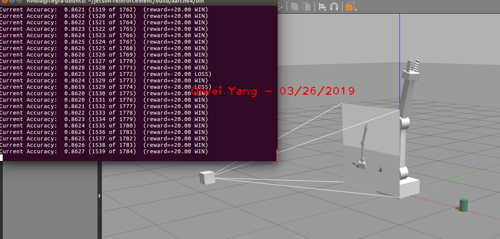

# Reinforcement-learning-Arm-Manipulation
Udacity Project: Deep Reinforcement Learning Arm Manipulation 

Qiwei Yang
  

### Introduction: 
This is my solution to the Udacity Project, Deep RL Arm Manipulation, as part of the Robotics Nano-Program. 
To me, the goals of this project are to get myself familiar with the core concepts of reinforcement learning, especially the deep
reinforcement learning, which is implemented as deep Q network in this project, and get hands-on experience on algorithm code. The task of this project
to train the arm to touch a target object correctly. 

**Object 1: ** Any part of the robot arm touch the target object before touching the ground and time expires is considered a success. 
This task is easy and as it only requires the robot arm to rotate along its base joint. In another word, this is simply a one-freedom problem.   
**Object 2: ** Only the gripper of the robot touch the target object is considered a success. This task is much more challenging than the first one, although they look similar, 
as it requires the robot to control its intermediate joints to make sure the gripper to touch the target object. This is a 3-freedom problem. 

 Lessons learnt:
 
 1. Deep reinforcement learning is much more difficult to implement and make it work. The reward assignment usually does not work as I expected, resulting in slow learning or not learning at all.
 Sophisticated reward system, and trial-and-error are needed.
 2. Simulation Environment is crucial and very hard to implement. Although the environment is already set up in this project, effort is worthy to revisit the source code to figure it out how the environment
 is established. This project is especially inspiring as it is integrated with PyTorch implemented in C, Gazebo, and deep reinforcement learning together. This project is excellent example to understand a complicated project.

### ArmPlugin.cpp file completion:

Before starting training, the ArmPlugin.cpp has to be implemented under the guides marked as "TODO".This cpp has several key functions as following:

1. Subscription to the camera image data and collision topics. The info is used to judge if expected touch between arm and target object is happened and rewards are given accordingly. 

2. Defining the correct collision/touch. This directly determines the reward that the agent will receive.

3. A DQN agent has to created as the controller. It controls the velocity and position of arms. 

### How does Deep Q-learning Network work in this project?

How image data is used in this project?
For reinforcement learning algorithms, state-action pair is required. Camera image in this project serves as state. It records each frame of images as one single state, along with the reward and action, in a buffer.
After the size of the buffer reaches a certain length, in our project 10,000. The stored data in the buffer are shuffled and random sampled to train the DQN. In this way, sequential control problem is converted to CNN,
or prediction problem. After enough training, for each image, a proper action (which is a series of controls about the joints) followed by an (or approximate) optimal policy will be generated.    

After running the training algorithm for a while, we choose a random selection from all the experiences gathered so far and create an average update for neural 
network weights which maximizes Q-values (rewards) for all actions taken during those experiences. This way we can teach our neural network to do increase and 
decrease position at the same time. Since very early experiences of moving the arm to target are not important—because they come from a time where our agent was 
less experienced, or even a beginner—we only keep track of a fixed number of past experiences and forget the rest. This process is termed experience replay.

Target Q network. 

Rather than updating Q function/value every step, a temporary Q network is used instead. For each training epoch, the temporary Q network is updated to make sure the smooth training process, and then assign the trained
temporary Q network to replace the actual Q function. 

### Reward System Implementation:

My intuition was that reward system is easy to implement. However, reward is a big deal. Take this project for instance, the objective 1 was achieved easily. For objective 2, half reward was given if the arm, but not the gripper, 
touched the target object, and full reward was given if the gripper touched the target object first. My thinking was that partial reward should give the agent some direction or hint to accomplish the ultimate goal, 
using the gripper. However, it was hard for the algorithm to converge using this intermediate reward signal. In the end, I had to remove the partial reward signal and only use the full reward instead. Finally, this reward system
worked well.   
  
The reward system that I found seemed to work: 

For Objective 1, either robot arm or gripper touching the target object counts success, and a full reward is given.  

For Objective 2, only gripper touching the target object counts success, and a full reward is given.  

##### Positive Rewards:

The positive rewards will encourage the agent to accumulate as much as possible. 

Generally, positive rewards encourage:

Keep going to accumulate reward.

Avoid terminals unless they yield very high reward (terminal state yields more single step reward than the discounted expected reward of continuing the episode)

Be careful with positive rewards. You need to make sure you don’t have a lot of reward near the terminals unless it’s a massive step function from where you were really close to it.

##### Negative Rewards:

Negative rewards are different. Negative rewards make the agent get done as quickly as possible because you’re constantly losing points when you play this game. That’s an Important distinction as you build these out.

Generally, negative rewards encourage:

Reach a terminal state as quickly as possible to avoid accumulating penalties

### Hyper-Parameters:

##### Objective 1: 
1) INPUT image size is 64 x 64, to reduce the size of the images
2) OPTIMIZER is "RMSDrop"
3) LEARNING RATE is 0.01, considering the training speed and accuracy 
4) REPLAY MEMORY: 10000
4) BATCH SIZE: 256
5) LSTM SIZE: 32
6) Reward_win: 20, Reward_loss: -20

##### Objective 2: 
1) INPUT image size is 64 x 64, to reduce the size of the images
2) OPTIMIZER is "Adam"
3) LEARNING RATE is 0.01, considering the training speed and accuracy 
4) REPLAY MEMORY: 10000
4) BATCH SIZE: 256
5) LSTM SIZE: 32

##### Summary: 

From my trials, it seemed that those parameters did not affect the training processes too much. 

### Results:

At the beginning of the training, the arm had no idea what were the proper actions, because there was no "correct" policy at all. Then it had random activities. These activities are important too, since they gave the agent
the opportunities to explore the environment and collect possible rewards, no matter positive or negative.  

Result of Object 1, **accuracy > 90%**. As mentioned before, this task was easy and it only required the agent to control its base joint. The algorithm converged quickly, within 50 episodes.  

Result of Object 2, **accuracy > 80%**. This task was harder. It took the agent about 140 episodes to reach 60% accuracy in my case. I kept it learning and was doing something else. After I came back, it finally reached 80%+ accuracy.  

### Future work:

1. Try to complete the challenge task. 
2. Even I completed the project with required accuracy, there are a lot of areas to improve. For example, reward system definitely can be improved to shorten the training time. How the control commands linked to
the reward system need exploration too in the this environment. 
3. I will revisit this project to gain more depth understandings in the simulation environment, the communications between ROS and DQN.  